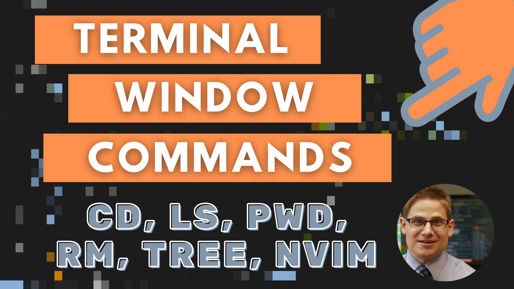

# terminal-commands

## Description

Do you want to explore the terminal window? Watch this video to learn more
about how to use commands like cd, ls, pwd, mkdir, cp, rm, more, tree, and
echo. Interested in learning how to debug a shell script by using a text editor
called Neovim? This video will teach you how!

Excited about this video? Then, [watch it on YouTube](https://youtu.be/EajfilB4GVw)!
